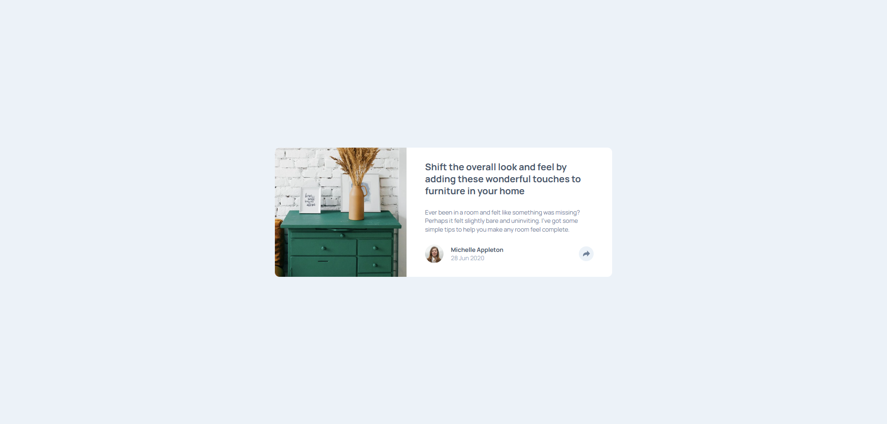

<h1 align="center">Article preview component</h1>

Solution to the Frontend Mentor challenge

  

This is a solution to the [Article preview component challenge on Frontend Mentor](https://www.frontendmentor.io/challenges/article-preview-component-dYBN_pYFT). Frontend Mentor challenges help you improve your coding skills by building realistic projects.

## Screenshot

Desktop view (1920px wide)

## Features

Users should be able to:
- View the optimal layout for the component depending on their device's screen size
- See the social media share links when they click the share icon

## Built with

- HTML
- CSS
- JavaScript

## Links

- Solution URL: https://www.frontendmentor.io/solutions/article-preview-card-component-GyELSrib72
- Live Site URL: https://articlepreview-abe.netlify.app

## Author

Find me on other platforms!

- Frontend Mentor: [@AverageBaguetteEnjoyer](https://www.frontendmentor.io/profile/AverageBaguetteEnjoyer)
- CodeWars: [AverageBaguetteEnjoyer](https://www.codewars.com/users/AverageBaguetteEnjoyer)
- Coddy: [@baguetteenjoyer](https://coddy.tech/user/baguetteenjoyer?via=share_profile)